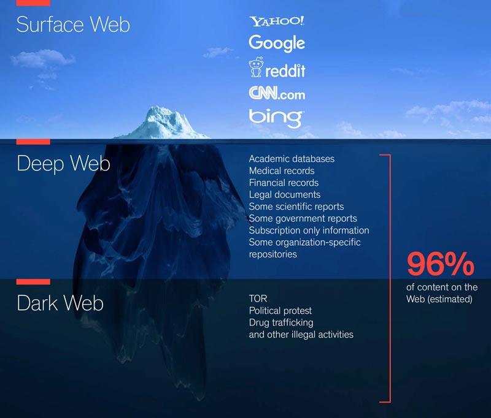
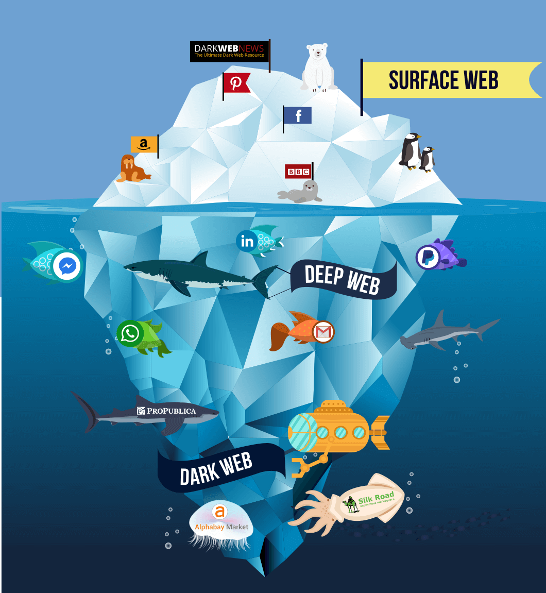

* Deep Web & Dark Web

** Web (Network of servers)
   - The internet is a huge network of computers all connected
     together. The world wide web (WWW or web for short) is a
     collection of webpages found on this network of computers. Your
     web browser uses the internet to access the web.

** 3 Types of Web 

   - Surface Web
   - Deep Web
   - Dark Web
     
** Surface Web (readily accessed)
   - It’s the common Internet everyone uses to read articles, news ,
     shop gadgets…etc. Just consider this the “regular” Internet.*
     like Google, Twitter, YouTube and so on.If we want to find some
     information we search them which leads us to a website which is
     in surface web i.e indexed page visible to search engines.

     - Accessing: Just search something in any search engine, it is a
       surface web , even google is a part of surface web

** Deep Web
   - The deep web, invisible web, or hidden web are parts of the World
     Wide Web whose contents are not indexed by standard web search
     engines. This means that you have to visit those places directly
     instead of being able to search for them.  Contains databses,
     social media, Academic information, government resources etc..,

     - Accessing: You will require exact address or URL as these pages are not
       indexed and can't be searched.

** Dark Web
   - Dark Web is a subset of the Deep Web that is not only not
     indexed, but that also requires something special to be able to
     access it, ex. specific proxying software or authentication to
     gain access( like TOR ). These pages require additional
     sub-network like Freenet ,I2P , TOR.  
     This is often associated with criminal activity of various
     degrees, including buying and selling drugs & weapons, gambling,
     hitman, etc..,
     As every coin has 2 sides, there are many legitimate usage of
     dark web also majority of which in field of journalism. Many
     journalist are required to protect their identity.

     - Accessing: You will require special software (TOR) and exact
       address or URL of the page.

    - Example with images 
     
            
      
** What is TOR?
   - Tor is free and open-source software for enabling anonymous
     communication. Tor directs Internet traffic through a free,
     worldwide, volunteer overlay network consisting of more than
     seven thousand relays to conceal a user's location and usage from
     anyone conducting network surveillance or traffic analysis. Using
     Tor makes it more difficult to trace Internet activity to the
     user: this includes "visits to Web sites, online posts, instant
     messages, and other communication forms". Tor's intended use is
     to protect the personal privacy of its users, as well as their
     freedom and ability to conduct confidential communication by
     keeping their Internet activities from being monitored.
** Why TOR? 
     - Tor browser is free to access.
     - It supports all major operating system.
     - Tor was originally called The Onion Router because it uses a
       technique called onion routing to conceal information about
       user activity
     - Encrypted messages will be sent from host to receiver thorugh
       several nodes.
     - Tor is an open source software which means the code can be
       inspected by anyone. This reduces the risk that it contains
       malicious backdoors.
     - Tor allows it’s user to circumvent censorship and it provides
       security by routing the internet through three relay servers
       (i.e. One for entering, one in the middle and the other at the
       end) which make them as secure like using three proxies.
     - It supports .onion sites which are impossible you to open on
       other existing browsers rather than Tor.
     - Hides your IP address from which you are accessing the deep or
       dark web. It is impossible to track your IP address of the
       system.

** Onion links
** Users (Researchers/Journalist/D)
** How to create a tor website.

   - Download and extract tor browser. [[https://www.torproject.org/download/][Link]]
   - After extracting the tar file go to the following location 
      /tor-browser_en-US/Browser/TorBrowser/Data/Tor
   - OR
   - Search for torrc file in the directory with locate 
     #+BEGIN_SRC 
     locate torrc 
     #+END_SRC
   - Open the torrc file and add the below lines 
     #+BEGIN_SRC 
     HiddenServiceStatistics 0
     HiddenServiceDir /home/swecha/Downloads/tor-browser_en-US/Browser/TorBrowser/Data/Tor/
     HiddenServicePort 80 127.0.0.1:80
     #+END_SRC
   - Make sure you have one your servers running and that they are on right port 
   - Here i choose apache2 as my server
   - hostname and private key
